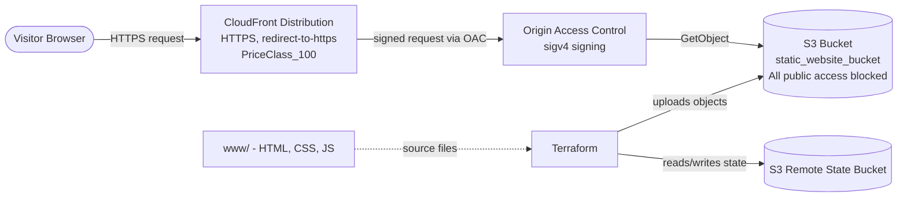

# Architecture

## Overview

This project hosts a static website on AWS using S3 for storage and
CloudFront as the content delivery network and HTTPS termination point.
The S3 bucket is never exposed directly to the internet — CloudFront is
the only permitted reader, enforced through Origin Access Control (OAC)
and a bucket policy scoped to the distribution's ARN.

## Diagram

## Components

### S3 Bucket (`aws_s3_bucket.static_website_bucket`)
Stores the static site files. All four public-access-block settings are
enabled (`block_public_acls`, `block_public_policy`, `ignore_public_acls`,
`restrict_public_buckets`), so the bucket has no public endpoint of its
own — it is reachable only via CloudFront.

### Origin Access Control (`aws_cloudfront_origin_access_control.oac`)
Replaces the legacy Origin Access Identity (OAI) mechanism. CloudFront
signs each request to S3 using SigV4, and the bucket policy trusts only
requests signed this way and originating from this specific distribution.

### Bucket Policy (`aws_s3_bucket_policy.allow_cloudfront`)
Grants `s3:GetObject` to the `cloudfront.amazonaws.com` service principal,
conditioned on `AWS:SourceArn` matching the CloudFront distribution's ARN.
This prevents any other CloudFront distribution (or direct S3 access)
from reading the bucket.

### CloudFront Distribution (`aws_cloudfront_distribution.s3_distribution`)
- Origin: the S3 bucket's regional domain name, via OAC
- `default_root_object = "index.html"`
- Viewer protocol policy: `redirect-to-https` (HTTP is upgraded, never served)
- Caching: `min_ttl = 0`, `default_ttl = 3600`, `max_ttl = 86400`
- `price_class = "PriceClass_100"` (US/Canada/Europe edge locations only,
  lowest cost tier)
- Uses the default CloudFront certificate (`*.cloudfront.net`); swap in
  an ACM certificate + `aliases` for a custom domain

### Site Content Upload (`aws_s3_object.object`)
Every file under `www/` is uploaded as an individual S3 object via
`fileset()`, with `etag = filemd5(...)` so Terraform only re-uploads
files that actually changed. Content type is inferred from file
extension via a lookup map, defaulting to `application/octet-stream`
for unrecognized types.

### Remote State (`backend.tf`)
Terraform state is stored in a separate S3 bucket
(`shaurya-terraform-state-bucket`) under the key
`static-website-hosting/terraform.tfstate`, with encryption enabled.
This bucket is provisioned out-of-band (not part of this configuration)
and must exist before running `terraform init`.

## Request Flow

1. A visitor requests the CloudFront domain (or a custom domain aliased
   to it) over HTTPS.
2. CloudFront checks its cache; on a miss, it forwards the request to
   the S3 origin, signing it via OAC.
3. S3 validates the signed request against the bucket policy's
   `AWS:SourceArn` condition and returns the object.
4. CloudFront caches the response per the configured TTLs and returns it
   to the visitor.

## Deployment Flow

1. `terraform init` — configures the S3 backend and downloads providers.
2. `terraform plan` / `terraform apply` — creates/updates the S3 bucket,
   OAC, bucket policy, CloudFront distribution, and uploads `www/`
   contents.
3. Output `website_url` gives the live CloudFront URL for the site.

## Possible Extensions

- Add an ACM certificate + Route 53 record for a custom domain
- Add a CloudFront custom error response mapping 403/404 to
  `index.html` for single-page-app routing
- Add a `aws_cloudfront_function` or Lambda@Edge for redirects/headers
- Add a CI/CD pipeline to run `terraform apply` on push to `main`
