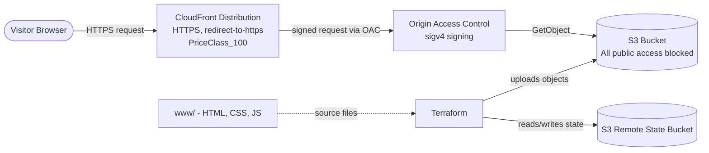

# Static Website Hosting with S3 and CloudFront

A Terraform project that hosts a static website on AWS. Site files live in a
**private** S3 bucket and are served to the internet only through
**CloudFront**, which is the sole party allowed to read from the bucket.
Nothing in S3 is publicly reachable — every visitor request goes through
CloudFront's CDN and HTTPS termination.

## Architecture



**Flow:** a visitor hits the CloudFront domain over HTTPS → CloudFront serves
from cache or fetches from S3, signing the request via OAC → S3 checks the
signature and the bucket policy's `AWS:SourceArn` condition before returning
the object → CloudFront caches and returns the response.

## Services Used

### Amazon S3 (Simple Storage Service)
Object storage used here to hold the static site files (HTML/CSS/JS).
S3 buckets have no inherent "web server" — by default every bucket is
private, and objects are addressed by key rather than a filesystem path.

Features enabled in this project:
- **S3 Block Public Access** (all four settings on) — the bucket cannot be
  made public even by accident, via ACL or bucket policy.
- **Bucket policy scoped to CloudFront** — only the `cloudfront.amazonaws.com`
  service principal can `GetObject`, and only when the request comes from
  this specific distribution's ARN.
- Individual object upload per file (`aws_s3_object`) with content-type
  detection by extension and change detection via MD5 `etag`, so
  `terraform apply` only re-uploads files that actually changed.

### Amazon CloudFront
A CDN (content delivery network) — a global network of edge locations that
cache content close to visitors, reducing latency and offloading traffic
from the origin (here, S3). It also serves as the HTTPS endpoint, since S3
static website endpoints don't support HTTPS natively.

Features enabled in this project:
- **Origin Access Control (OAC)** — the modern replacement for Origin Access
  Identity (OAI). CloudFront signs every request to S3 using SigV4, proving
  to S3 that the request genuinely came from this distribution.
- **`redirect-to-https` viewer protocol policy** — any HTTP request is
  upgraded to HTTPS; plaintext is never served to visitors.
- **Caching** — `default_ttl = 3600`s, `max_ttl = 86400`s, so repeat
  visitors are served from the nearest edge cache instead of hitting S3.
- **`default_root_object = "index.html"`** — requests to `/` resolve to
  `index.html` automatically.
- **`PriceClass_100`** — restricts edge locations to North America and
  Europe, the lowest-cost pricing tier (trades some latency in other
  regions for lower cost).

### Terraform Remote State (S3 Backend)
Terraform tracks the real-world resources it manages in a *state file*.
Storing that state remotely in S3 (instead of locally) means the state
survives a wiped machine and can safely be shared between runs/collaborators.

Features enabled in this project:
- Remote backend pointed at a separate, pre-existing S3 bucket
  (`backend.tf`), keyed under `static-website-hosting/terraform.tfstate`.
- **Encryption at rest** enabled for the state file.

## Project Structure

```
.
├── main.tf                    # S3 bucket, bucket policy, OAC, CloudFront distribution, site uploads
├── variables.tf                # Input variables
├── outputs.tf                   # Bucket name/ARN, CloudFront ID/domain, website URL
├── providers.tf                  # AWS provider and default tags
├── backend.tf                     # Remote state backend config
├── local.tf                        # Local values
├── terraform.tfvars.example         # Example variable values
└── www/                               # Static site content (HTML/CSS/JS)
```
