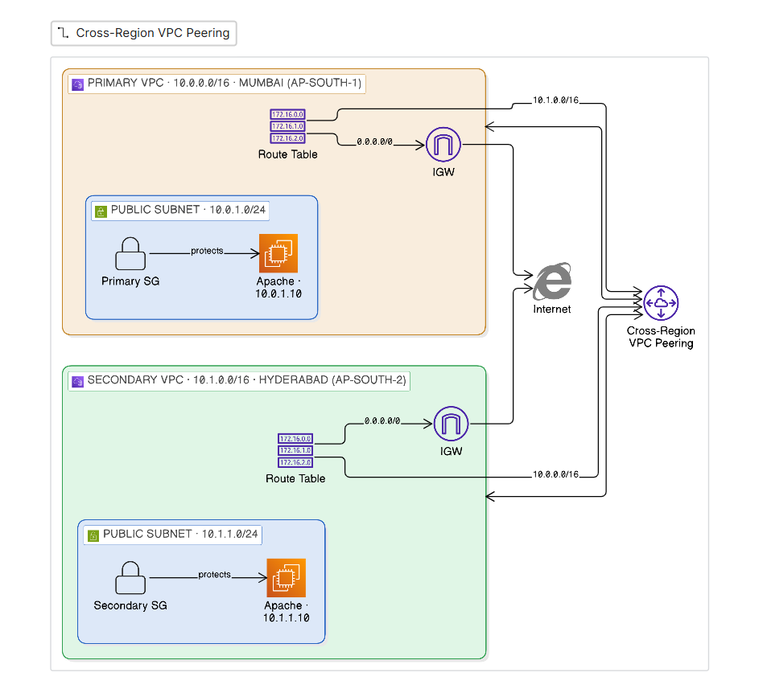
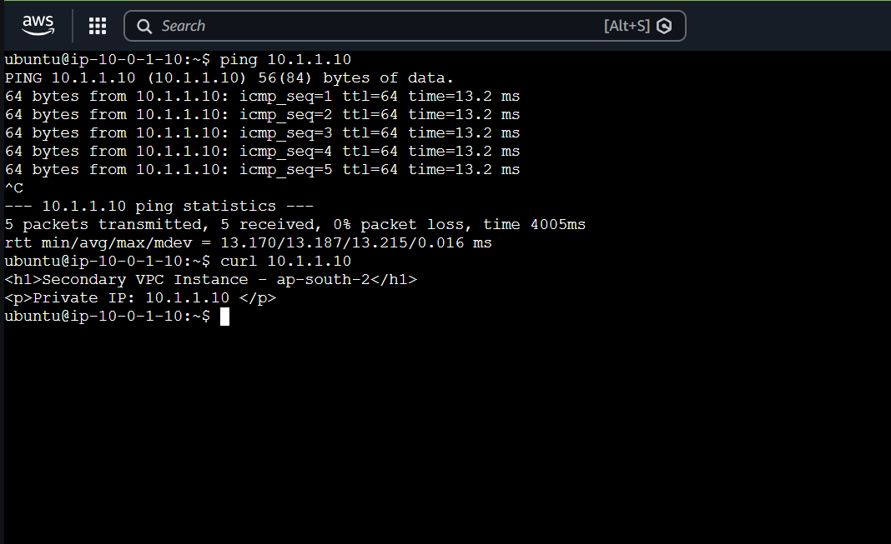
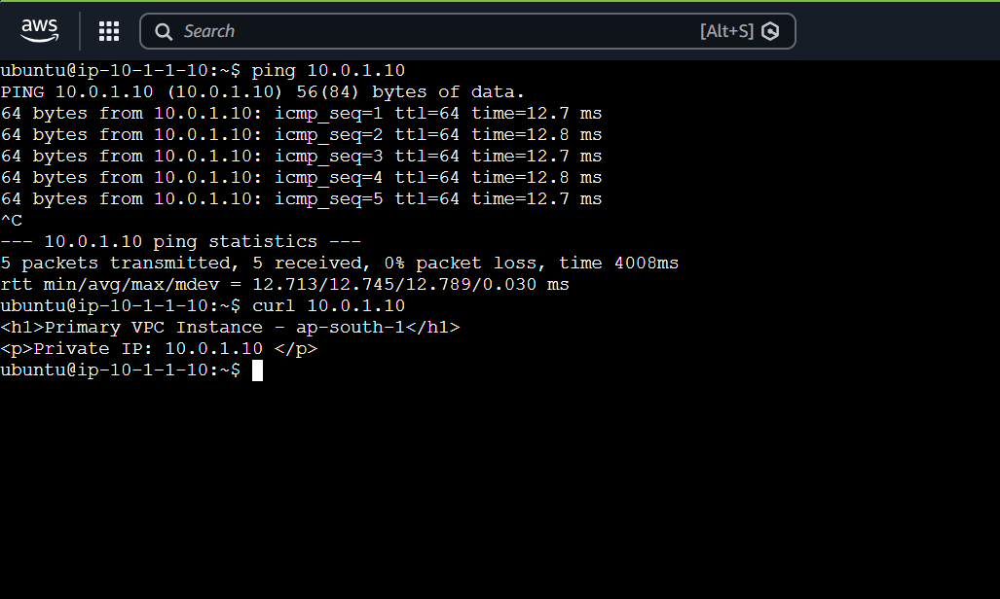
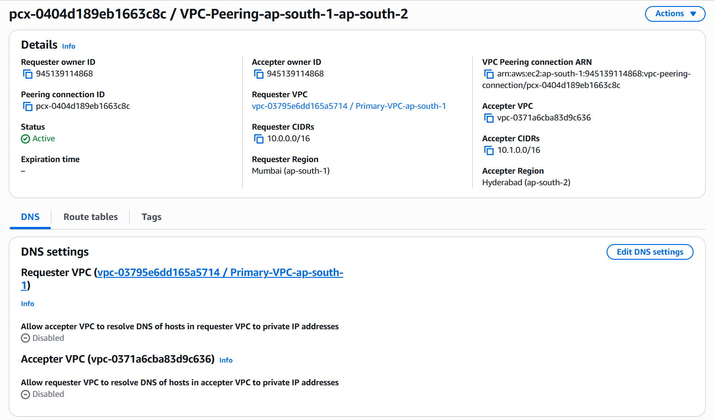
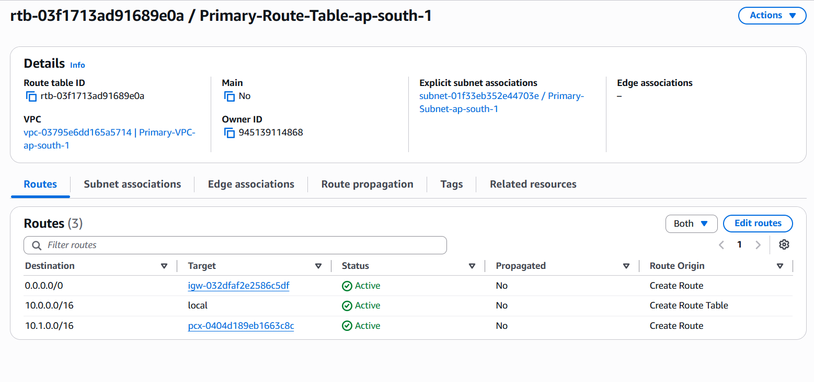
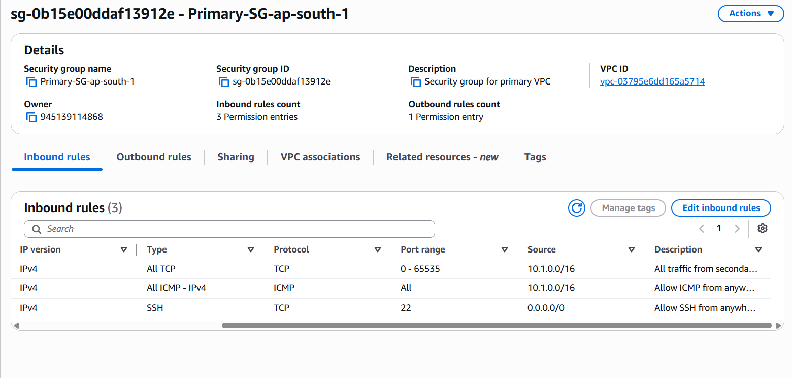

# Cross-Region VPC Peering

Private, cross-region connectivity between two isolated VPCs (`ap-south-1` and
`ap-south-2`) using an AWS VPC peering connection, provisioned with Terraform.
Traffic between the VPCs traverses the AWS backbone over private IPs — never
the public internet. Validated with live ICMP and HTTP between instances in
different regions.

> Part of the [VPC Peering series](../README.md): **2-VPC (this)** ·
> [3-VPC full mesh](../3-vpc-full-mesh/) · [3-VPC transit gateway](../3-vpc-transit-gateway/)

## Architecture



## AWS Services Used

| Service | Purpose |
|---|---|
| **VPC Peering** | Private cross-region link between the two VPCs |
| **Route Tables** | Direct peer-CIDR traffic through the peering connection |
| **Security Groups** | Allow ICMP/TCP inbound from the peer VPC CIDR |
| VPC | Two isolated networks — `10.0.0.0/16` and `10.1.0.0/16` |
| Subnets | One public `/24` per VPC |
| Internet Gateway | Outbound access for instance bootstrap and SSH |
| EC2 | Endpoints used only to validate connectivity |
| S3 | Remote, encrypted Terraform state backend |
| Provider aliases | Manage two regions from one configuration |

## Core Concepts

### Cross-Region VPC Peering

**What it is** — A one-to-one, non-transitive network connection between two
VPCs that routes over the AWS backbone using private IPs. Cross-region peering
joins VPCs in different regions.

**Why it is used here** — To connect two regionally-isolated VPCs so instances
communicate over private IPs without exposing traffic to the public internet.

**AWS implementation** — `aws_vpc_peering_connection` on the requester with
`peer_region` set, accepted by `aws_vpc_peering_connection_accepter` in the
peer region. `auto_accept = false` — cross-region peering cannot be
auto-accepted in a single step.

**Best practices** — Non-overlapping CIDRs; add only the required routes;
least-privilege security groups; move to Transit Gateway once beyond a few VPCs
(peering is non-transitive and grows at N(N−1)/2).

**Interview points**
- Non-transitive — A↔B and B↔C does **not** give A↔C.
- Overlapping CIDRs are rejected.
- Security groups **cannot** reference peer SGs across region/account — use CIDRs.
- Cross-region peering does not support jumbo frames (MTU capped at 1500).
- Cross-region data transfer is billed per GB in both directions.

### Route Tables

**What it is** — Rules mapping a destination CIDR to a target; one route table
per subnet; most-specific (longest-prefix) route wins.

**Why it is used here** — A peering connection carries no traffic until each
side has a route to the other's CIDR pointing at the connection.

**AWS implementation** — Standalone `aws_route` with `vpc_peering_connection_id`
on **both** route tables (`10.1.0.0/16` on the primary, `10.0.0.0/16` on the
secondary), plus a default route to the IGW.

**Best practices** — Never mix inline `route {}` blocks with `aws_route`
resources on the same table (causes perpetual conflicts); define return routes
explicitly on both sides.

**Interview points**
- Peering requires routes on **both** VPCs — it is not automatic.
- A peering connection alone does nothing without routes.
- Longest-prefix match determines the selected route.

### Security Groups

**What it is** — A stateful, allow-only virtual firewall bound to an instance's
ENI; rules are evaluated as a union; return traffic is implicitly permitted.

**Why it is used here** — To admit cross-VPC traffic, each SG must explicitly
allow inbound from the **peer** VPC's CIDR (ICMP for reachability, TCP for the
application).

**AWS implementation** — `aws_security_group` ingress with
`cidr_blocks = [peer_vpc_cidr]` for ICMP and TCP; SSH scoped separately for
management.

**Best practices** — Reference peer **CIDRs** (SG references don't work across
regions); split management (SSH) from workload rules; keep port ranges tight.

**Interview points**
- Stateful — allowing inbound automatically permits the response.
- Allow-only; use NACLs for explicit deny.
- Cross-region/cross-account peering forces CIDR-based rules, not SG references.

## Project Implementation

- Two VPCs in `ap-south-1` and `ap-south-2` with non-overlapping CIDRs.
- Cross-region peering via the requester / accepter pattern (`auto_accept = false`).
- Route tables on both sides directing the peer CIDR through the peering connection.
- Security groups allowing ICMP + TCP from the peer VPC CIDR.
- Fixed private IPs (`10.0.1.10` / `10.1.1.10`) for stable validation.
- Multi-region provider aliases; remote encrypted S3 state.

## Validation

### Cross-region private connectivity



Ping (0% loss) and HTTP succeed **both directions** between instances in
different regions, addressed by private IP — proving traffic routes over the
peering connection, not the internet.

### Peering connection active (cross-region)


Requester in Mumbai (`10.0.0.0/16`) and accepter in Hyderabad (`10.1.0.0/16`),
status **Active** — confirming an established cross-region peering.

### Peering route in the route table


The route table forwards the peer CIDR (`10.1.0.0/16`) to the peering
connection (`pcx-…`) — the routing that makes peering functional.

### Security group admitting the peer VPC


Inbound ICMP and all-TCP sourced from the peer VPC CIDR (`10.1.0.0/16`) — what
allows cross-VPC traffic to be accepted.

## Key Learnings

- Peering is **non-transitive** and requires routes **and** SG rules on both sides.
- **Non-overlapping CIDRs** are mandatory for peering.
- Cross-region peering **cannot** use security-group references — rules must be CIDR-based.
- Isolating ICMP vs TCP (ping works, curl fails) pinpoints SG/service issues vs routing.
- Mixing inline routes with `aws_route` resources causes route conflicts.

## Repository Structure

```
2-vpc-peering/
├── main.tf         # VPCs, subnets, IGWs, route tables, peering, security groups, EC2
├── data.tf         # AMI and Availability Zone lookups
├── variables.tf    # Regions, CIDRs, key names
├── outputs.tf      # Instance private/public IPs
├── providers.tf    # Multi-region provider aliases
├── backend.tf      # Remote S3 state
└── Screenshots/    # Validation evidence
```
