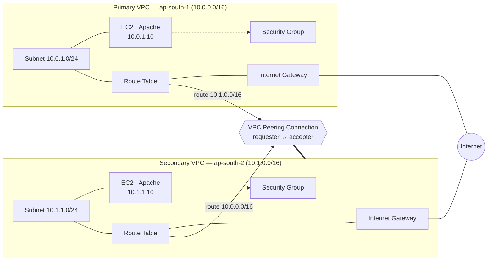
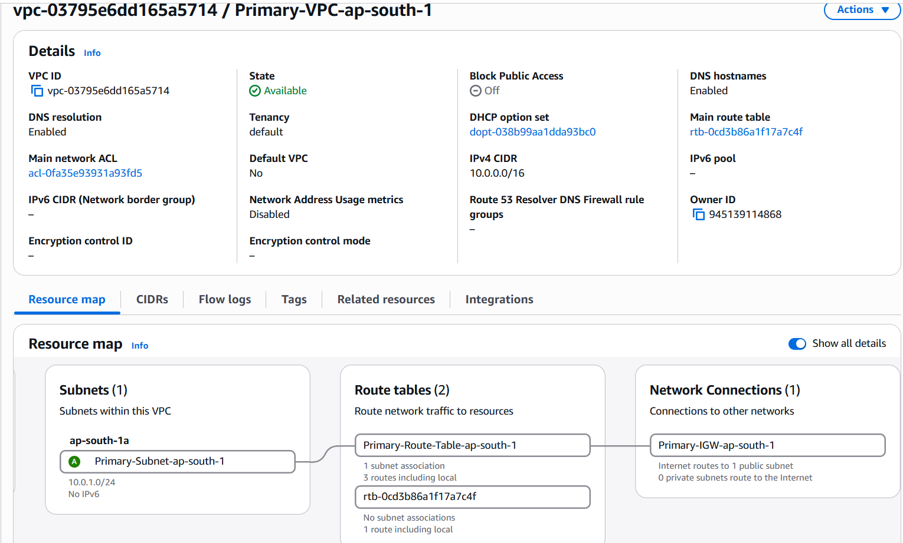
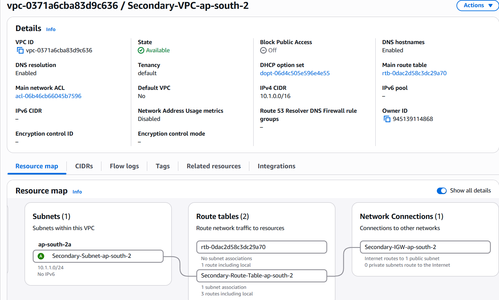
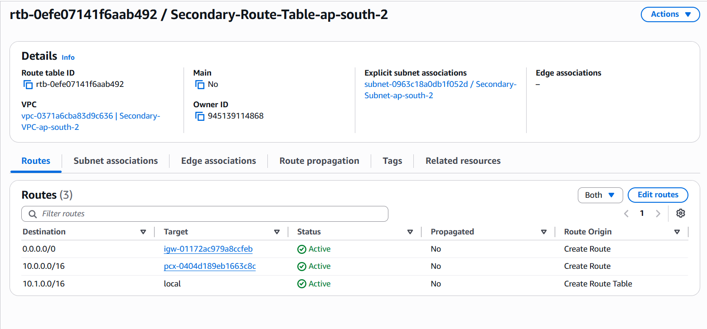
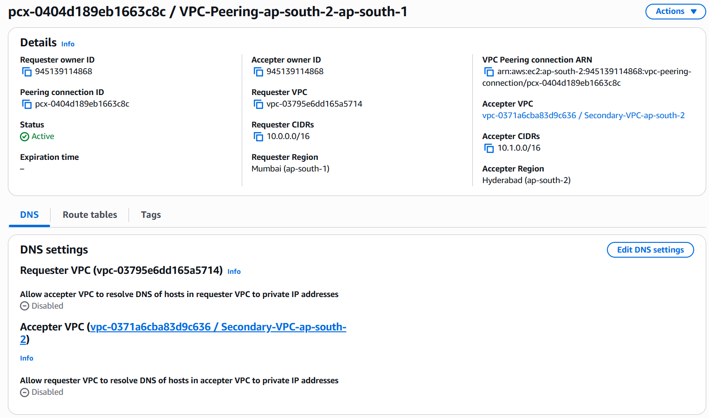
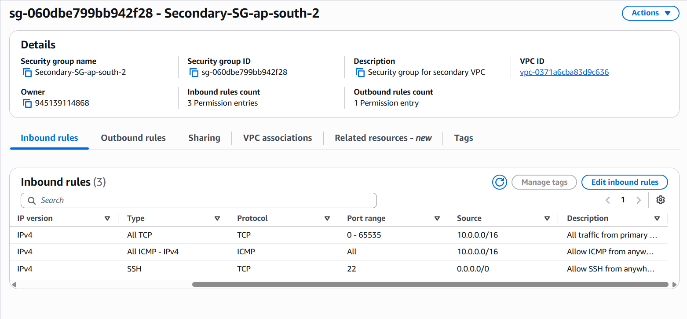

# Cross-Region VPC Peering on AWS with Terraform

> Infrastructure-as-Code project that provisions two isolated VPCs in **two
> different AWS regions** and connects them privately using a **cross-region
> VPC peering connection**, verified with live traffic between EC2 instances
> over private IPs.

| | |
|---|---|
| **Cloud Provider** | Amazon Web Services (AWS) |
| **IaC Tool** | Terraform (`~> 6.0` AWS provider) |
| **Regions** | `ap-south-1` (Mumbai) · `ap-south-2` (Hyderabad) |
| **State Backend** | Amazon S3 (remote, encrypted) |
| **Status** | Deployed & verified — 0% packet loss, HTTP reachable over peering |

> **Part of the [VPC Peering series](../README.md):** **2-VPC (this)** ·
> [3-VPC full mesh](../3-vpc-full-mesh/) · [3-VPC transit gateway](../3-vpc-transit-gateway/)

---

## Table of Contents

1. [Overview](#overview)
2. [Objectives](#objectives)
3. [Architecture](#architecture)
4. [AWS Services & Concepts](#aws-services--concepts)
5. [Technology Stack](#technology-stack)
6. [Repository Structure](#repository-structure)
7. [Prerequisites](#prerequisites)
8. [Configuration Reference](#configuration-reference)
9. [Deployment Guide](#deployment-guide)
10. [Verification](#verification)
11. [Troubleshooting & Lessons Learned](#troubleshooting--lessons-learned)
12. [Cost Considerations](#cost-considerations)
13. [Cleanup](#cleanup)

---

## Overview

By default, every Amazon VPC is a completely isolated network — two VPCs cannot
communicate, even within the same account, and especially not across regions.
This project demonstrates how to join two such networks into a single routable
address space using **VPC peering**, while each VPC retains its own CIDR block,
subnet, internet gateway, route table and security boundary.

Two EC2 instances — one in each region — run Apache and are proven to reach
each other over the peering link using **private IP addresses only**. Traffic
travels across the AWS global backbone and never touches the public internet.

## Objectives

- Provision two VPCs with **non-overlapping CIDR blocks** in two different AWS
  regions using a single Terraform configuration.
- Establish a **cross-region VPC peering connection** using the requester /
  accepter pattern.
- Configure **route tables** and **security groups** on both sides so the VPCs
  can route to and accept traffic from one another.
- Bootstrap an EC2 web server in each VPC via **user data** (cloud-init).
- **Verify** private connectivity end-to-end with `ping` (ICMP) and `curl`
  (HTTP) across the peering connection.
- Manage everything with **remote, encrypted Terraform state** in S3.

## Architecture


<details>
<summary>Text-based (Mermaid) version of the same diagram</summary>



</details>

**Traffic flow:** the primary route table sends anything destined for
`10.1.0.0/16` into the peering connection; the secondary route table does the
reverse for `10.0.0.0/16`. Each security group explicitly allows inbound
traffic from the *other* VPC's CIDR. So a request from `10.0.1.10` to
`10.1.1.10` is routed over the peering link, admitted by the secondary security
group, and answered by Apache — entirely over private IPs.

## AWS Services & Concepts

Each concept below is followed by the actual console screenshot from this
deployment, so the theory maps directly onto what was built.

### Amazon VPC (Virtual Private Cloud)

**What it is**
- A logically isolated virtual network in AWS where you control the IP range,
  subnets, routing and gateways.
- **Region-scoped** and isolated by default — two VPCs cannot talk to each
  other until explicitly connected.
- Peering requires **non-overlapping CIDRs**, because overlapping addresses
  make routing ambiguous.

**Used in this project**
- Two VPCs with non-overlapping CIDRs: `10.0.0.0/16` (Mumbai) and `10.1.0.0/16`
  (Hyderabad).
- `enable_dns_support` and `enable_dns_hostnames` turned on.
- Each VPC created through a separate **provider alias** (one per region).

The resource map for each VPC below shows the single `/24` subnet, its route
tables, and the attached Internet Gateway:

| Primary VPC — ap-south-1 | Secondary VPC — ap-south-2 |
|---|---|
|  |  |

### Subnets

**What it is**
- A sub-range of a VPC's CIDR, bound to a single Availability Zone.
- Instances live in subnets, not directly in the VPC.
- A subnet is "public" when its route table has a path to an Internet Gateway.

**Used in this project**
- `cidrsubnet(vpc_cidr, 8, 1)` carves a `/24` (`10.0.1.0/24`, `10.1.1.0/24`)
  out of each `/16`.
- `map_public_ip_on_launch = true` so instances get a public IP for SSH.
- Availability Zone chosen dynamically via the `aws_availability_zones` data
  source (visible as `ap-south-1a` / `ap-south-2a` in the VPC maps above).

### Internet Gateway (IGW)

**What it is**
- A horizontally-scaled, highly-available component connecting a VPC to the
  internet.
- Performs network address translation for instances that have public IPs.
- Without an IGW (and a route to it), a subnet is entirely private.

**Used in this project**
- One IGW per VPC — needed so instances can `apt-get install apache2` on first
  boot and so you can SSH in from your workstation.
- Shown as `Primary-IGW-ap-south-1` / `Secondary-IGW-ap-south-2` in the VPC
  resource maps above.

### Route Tables & Routes

**What it is**
- A route table maps a **destination CIDR** to a **target** (IGW, peering
  connection, etc.).
- Every subnet is associated with exactly one route table.
- The most specific matching route wins (**longest-prefix match**).

**Used in this project**
- **Standalone `aws_route` resources** only — never mixed with inline
  `route {}` blocks, since mixing the two styles on one table makes Terraform
  conflict on every apply.
- A default route `0.0.0.0/0 → IGW` and a **peering route** to the other VPC's
  CIDR, per VPC.
- `aws_route_table_association` binding each subnet to its table.

Each table shows three **Active** routes — `local`, the internet route, and the
peering route via `pcx-0404d189eb1663c8c`:

| Primary route table | Secondary route table |
|---|---|
|  |  |

### VPC Peering Connection

**What it is**
- A direct, private network link between two VPCs, so resources communicate
  using private IPs as if on the same network.
- Traffic stays on the AWS backbone — never the public internet.
- **Non-transitive** (A↔B and B↔C does not give A↔C) and requires
  non-overlapping CIDRs.

**Used in this project**
- `aws_vpc_peering_connection` on the requester with `peer_region` set — this
  is what makes it **cross-region**.
- `auto_accept = false` plus a separate `aws_vpc_peering_connection_accepter`
  in the peer region — cross-region peering **cannot** be auto-accepted in one
  step.
- Routes on **both** sides pointing at the connection (shown above).

The connection is **Active**, with requester in Mumbai (`10.0.0.0/16`) and
accepter in Hyderabad (`10.1.0.0/16`):

| Requester side (Mumbai) | Accepter side (Hyderabad) |
|---|---|
|  |  |

### Security Groups

**What it is**
- A **stateful** virtual firewall on an instance's network interface — return
  traffic for allowed inbound flows is permitted automatically.
- **Allow-only** (no explicit deny rules); evaluated as the union of all rules.

**Used in this project**
- **SSH (TCP 22)** from anywhere for administration.
- **ICMP** from the peer CIDR — this is what makes `ping` work.
- **All TCP (0–65535)** from the peer CIDR — this is what makes `curl`/HTTP
  work between the VPCs.
- All outbound traffic allowed.

Inbound rules on each SG, sourced from the *peer* VPC's CIDR:

| Primary SG (source `10.1.0.0/16`) | Secondary SG (source `10.0.0.0/16`) |
|---|---|
|  |  |

### Amazon EC2 (Elastic Compute Cloud)

**What it is**
- Resizable virtual servers booted from an AMI, running in a subnet and
  protected by security groups.

**Used in this project**
- AMI resolved dynamically via the `aws_ami` data source (latest Ubuntu 24.04
  LTS per region).
- `user_data` cloud-init script installs and starts Apache on first boot —
  **runs only once, at first boot**.
- Fixed `private_ip` (`10.0.1.10` / `10.1.1.10`) for stable addressing across
  rebuilds.
- Region-specific key pairs for SSH.

*(The running instances are proven working in the [Verification](#verification)
section.)*

### Terraform Multi-Provider (Provider Aliases)

**What it is**
- A single Terraform configuration can manage multiple regions/accounts by
  declaring the provider more than once with different `alias` values.

**Used in this project**
- Provider declared twice: `primary` → `ap-south-1`, `secondary` →
  `ap-south-2`.
- Every resource selects its region via `provider = aws.primary` or
  `provider = aws.secondary`.

### Terraform Remote State (S3 Backend)

**What it is**
- Terraform records the resources it manages in a *state file*.
- Storing it remotely (S3) means it survives a wiped machine and can be shared
  across runs.

**Used in this project**
- Remote S3 backend keyed under `vpc-peering/terraform.tfstate`, with
  encryption at rest enabled.

## Technology Stack

| Layer | Technology |
|---|---|
| Cloud | AWS (VPC, EC2, Internet Gateway, Route Tables, Security Groups, VPC Peering) |
| IaC | Terraform, HCL, AWS provider `~> 6.0` |
| State | Amazon S3 (remote backend, encrypted) |
| Compute OS | Ubuntu 24.04 LTS |
| Web server | Apache HTTP Server (via cloud-init user data) |

## Repository Structure

```
.
├── main.tf                  # VPCs, subnets, IGWs, route tables/routes, peering, SGs, EC2 instances
├── data.tf                  # AMI and Availability Zone data sources (per region)
├── local.tf                 # user_data bootstrap scripts (install + start Apache)
├── variables.tf             # Input variables (regions, CIDRs, instance type, key names)
├── outputs.tf               # Instance public/private IPs
├── providers.tf             # AWS provider aliases (primary / secondary regions)
├── backend.tf               # Remote state backend + required providers
├── terraform.tfvars         # Variable values (git-ignored)
├── terraform.tfvars.example # Example variable values
├── Screenshots/             # Console + terminal evidence
└── README.md
```

## Prerequisites

- An AWS account with permissions for VPC, EC2 and S3.
- **Terraform** ≥ 1.5 and the **AWS CLI**, both configured with credentials.
- An existing **S3 bucket** for remote state (referenced in `backend.tf`).
- **EC2 key pairs** created in *both* regions (`ap-south-1` and `ap-south-2`)
  for SSH access, with the corresponding `.pem` files available locally.
- Region **`ap-south-2` (Hyderabad) enabled** on the account (opt-in region).

## Configuration Reference

### Input Variables (`variables.tf`)

| Variable | Description | Default |
|---|---|---|
| `environment` | Environment tag applied to resources | `development` |
| `primary` | Primary region | `ap-south-1` |
| `secondary` | Secondary region | `ap-south-2` |
| `primary_vpc_cidr` | CIDR block for the primary VPC | `10.0.0.0/16` |
| `secondary_vpc_cidr` | CIDR block for the secondary VPC | `10.1.0.0/16` |
| `instance_type` | EC2 instance type | `t3.micro` |
| `primary_key_name` | Key pair name in the primary region | `vpc-peering-demo` |
| `secondary_key_name` | Key pair name in the secondary region | `vpc-peering-demo` |

> **Note on key pairs:** the key-pair *names* are the same in both regions, but
> key pairs are region-specific, so each region has its own key material. Use
> the `.pem` file that matches the region you are connecting to.

### Outputs (`outputs.tf`)

| Output | Description |
|---|---|
| `primary_instance_private_ip` | Private IP of the primary instance (`10.0.1.10`) |
| `primary_instance_public_ip` | Public IP of the primary instance (for SSH) |
| `secondary_instance_private_ip` | Private IP of the secondary instance (`10.1.1.10`) |
| `secondary_instance_public_ip` | Public IP of the secondary instance (for SSH) |

## Deployment Guide

1. **Clone and initialize**
   ```bash
   terraform init
   ```
2. **Set variables** — copy the example and adjust as needed:
   ```bash
   cp terraform.tfvars.example terraform.tfvars
   ```
3. **Review the plan**
   ```bash
   terraform plan
   ```
4. **Apply**
   ```bash
   terraform apply
   ```
5. **Read the outputs**
   ```bash
   terraform output
   ```

> The Apache install runs on first boot via cloud-init and takes ~1–2 minutes.
> If `curl` refuses or hangs immediately after launch, wait until
> `cloud-init status` reports `done` on the target instance.

## Verification

SSH into the primary instance (public IP + matching key), then reach the
secondary over its **private** IP across the peering link:

```bash
# from the primary instance (10.0.1.10):
ping 10.1.1.10          # ICMP over peering  → 0% packet loss
curl http://10.1.1.10   # HTTP over peering  → "Secondary VPC Instance - ap-south-2"
```

**Primary → Secondary** (`10.0.1.10` → `10.1.1.10`)


And the reverse, from the secondary instance:

```bash
# from the secondary instance (10.1.1.10):
ping 10.0.1.10
curl http://10.0.1.10   # "Primary VPC Instance - ap-south-1"
```

**Secondary → Primary** (`10.1.1.10` → `10.0.1.10`)


**Success criteria:** clean pings (0% loss) **and** each instance returns the
peer's Apache page over the private IP — proving the two regions are joined
into one routable network.

## Troubleshooting & Lessons Learned

| Symptom | Root cause | Fix |
|---|---|---|
| `curl` refused but `ping` works | No web server listening — `user_data` was never attached to the instance | Reference `user_data` on the instance and recreate it |
| Apache missing on a running box | `user_data` only runs at **first boot**; instance was launched before it was wired in | Recreate the instance (`terraform apply -replace=...`) |
| IPs change on every apply | No fixed `private_ip`; addresses reassigned each rebuild | Set a fixed `private_ip` per instance |
| `RouteAlreadyExists` on apply | Inline `route {}` blocks mixed with standalone `aws_route` on the same table | Use one style only — all standalone `aws_route` |
| Intermittent ping | Testing against a stale IP from a previous rebuild | Read the current IP from `terraform output` |
| SSH `Permission denied` | On Windows, an over-permissive `.pem` is ignored by OpenSSH; or wrong region's key | Restrict the key with `icacls`; use the `.pem` matching that region |

**Key takeaways**
- Non-overlapping CIDRs are mandatory for peering.
- Cross-region peering needs the requester + accepter two-resource pattern.
- `ping` working while `curl` fails means the network path is fine — look at
  the service or the TCP rule, not the peering.
- Key pairs are region-specific even when they share a name.

> **Want 3 VPCs?** See the sibling projects:
> [3-VPC full mesh (no Transit Gateway)](../3-vpc-full-mesh/) and
> [3-VPC with Transit Gateway](../3-vpc-transit-gateway/).

## Cost Considerations

- **EC2:** two `t3.micro` instances (free-tier eligible in each region within
  limits; otherwise on-demand hourly).
- **VPC peering:** no hourly charge for the connection itself, but
  **cross-region data transfer is billed** in both directions.
- **S3:** negligible cost for the small remote state object.
- VPCs, subnets, route tables, IGWs and security groups incur no direct charge.

> Run `terraform destroy` when finished to avoid ongoing charges.

## Cleanup

```bash
terraform destroy
```

This removes both instances, the peering connection, security groups, route
tables, IGWs, subnets and VPCs across both regions. The remote state object and
the state bucket are **not** managed by this configuration and remain.
