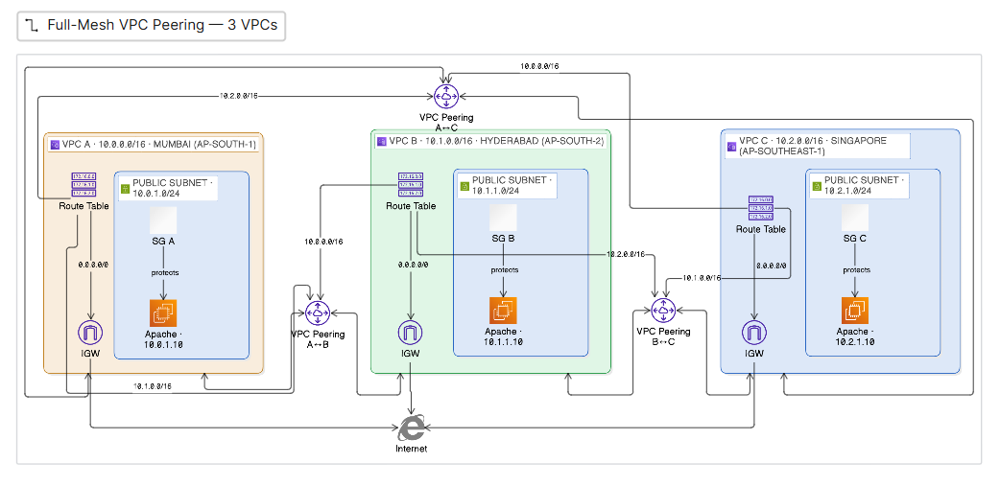

# 3-VPC Full-Mesh Peering (without Transit Gateway)

> Connect **three** VPCs so every VPC can reach every other, using **only VPC
> peering** — no Transit Gateway. Because peering is non-transitive, this
> requires a **full mesh** of direct peering connections.

| | |
|---|---|
| **Cloud Provider** | Amazon Web Services (AWS) |
| **IaC Tool** | Terraform (`~> 6.0` AWS provider) |
| **Regions** | `ap-south-1` · `ap-south-2` · `ap-southeast-1` |
| **Topology** | Full mesh — 3 peering connections |
| **Status** | 🚧 Work in progress (3rd VPC scaffolded; mesh peering TODO) |

> **Part of the [VPC Peering series](../README.md):**
> [2-VPC](../2-vpc-peering/) · **3-VPC full mesh (this)** ·
> [3-VPC transit gateway](../3-vpc-transit-gateway/)

## Why a full mesh?

VPC peering is **non-transitive**: if VPC A peers with B, and B peers with C,
then A **cannot** reach C through B. To give all three VPCs mutual
connectivity you must peer **every pair directly**.

- **3 peering connections** — `A↔B`, `B↔C`, `A↔C`.
- In general, N VPCs need **N(N−1)/2** connections (3 for three VPCs, 6 for
  four, 10 for five) — this quadratic growth is exactly why full mesh doesn't
  scale, and why [Transit Gateway](../3-vpc-transit-gateway/) exists.
- **Each route table needs a route to each peer CIDR**, pointing at the correct
  peering connection.

## Architecture



| VPC | Region | CIDR | Subnet | Instance |
|---|---|---|---|---|
| A (Primary) | ap-south-1 (Mumbai) | `10.0.0.0/16` | `10.0.1.0/24` | `10.0.1.10` |
| B (Secondary) | ap-south-2 (Hyderabad) | `10.1.0.0/16` | `10.1.1.0/24` | `10.1.1.10` |
| C (Tertiary) | ap-southeast-1 (Singapore) | `10.2.0.0/16` | `10.2.1.0/24` | `10.2.1.10` |

### Routing (what each route table needs)

| Route table | Local | Internet | Peer routes |
|---|---|---|---|
| RT A | `10.0.0.0/16` | `0.0.0.0/0 → IGW` | `10.1.0.0/16 → A↔B`, `10.2.0.0/16 → A↔C` |
| RT B | `10.1.0.0/16` | `0.0.0.0/0 → IGW` | `10.0.0.0/16 → A↔B`, `10.2.0.0/16 → B↔C` |
| RT C | `10.2.0.0/16` | `0.0.0.0/0 → IGW` | `10.0.0.0/16 → A↔C`, `10.1.0.0/16 → B↔C` |

## Terraform structure

Building on the [2-VPC project](../2-vpc-peering/), the full mesh is the same
pattern scaled to three:

- **3 VPCs / subnets / IGWs / route tables** (one per region, via provider
  aliases `primary`, `secondary`, `tertiary`).
- **3 `aws_vpc_peering_connection` + `aws_vpc_peering_connection_accepter`
  pairs** — one per edge (`A↔B`, `A↔C`, `B↔C`).
- **6 peer `aws_route` resources** — two per route table.
- **3 EC2 instances + security groups**, each SG allowing ICMP/TCP from the
  *other two* VPC CIDRs.

### ⚠️ Status — what's done and what's left

The Terraform here is a **work in progress**, carried over from active
development:

- ✅ Third VPC, subnet, IGW, route table + association scaffolded.
- ✅ `tertiary` provider (`ap-southeast-1`), `tertiary` AZ data source, and
  `tertiary_vpc_cidr` (`10.2.0.0/16`) added.
- ⬜ Third EC2 instance + security group.
- ⬜ The two extra peering connections (`A↔C`, `B↔C`) and their accepters.
- ⬜ The six peer routes (two per route table, per the table above).

> Note: the `tertiary` region default was changed from the placeholder
> `ap-south-3` (not a real AWS region) to `ap-southeast-1`.

## Deploy

This project uses its **own** remote state key
(`vpc-peering-full-mesh/terraform.tfstate`), independent of the 2-VPC project.

```bash
terraform init
terraform plan
terraform apply
```

## Verification (once complete)

From any instance, both other private IPs should ping and curl successfully —
proving all three VPCs reach each other directly:

```bash
# from VPC A (10.0.1.10):
curl http://10.1.1.10   # VPC B
curl http://10.2.1.10   # VPC C
```
