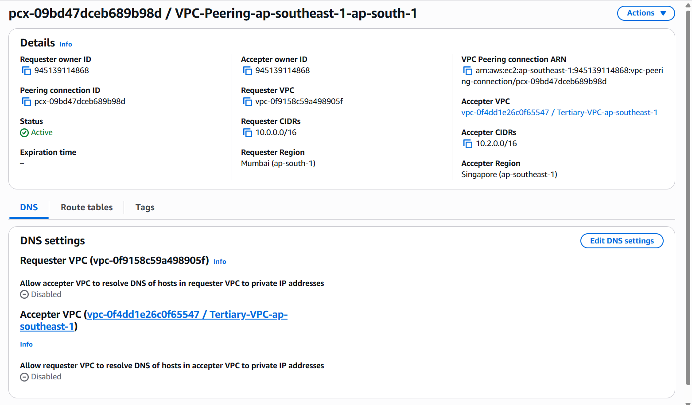
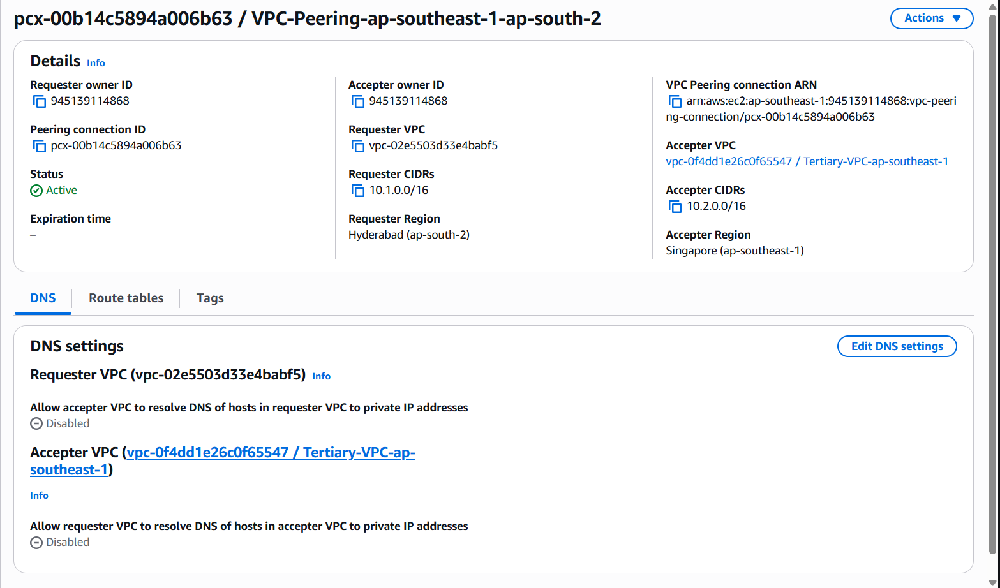
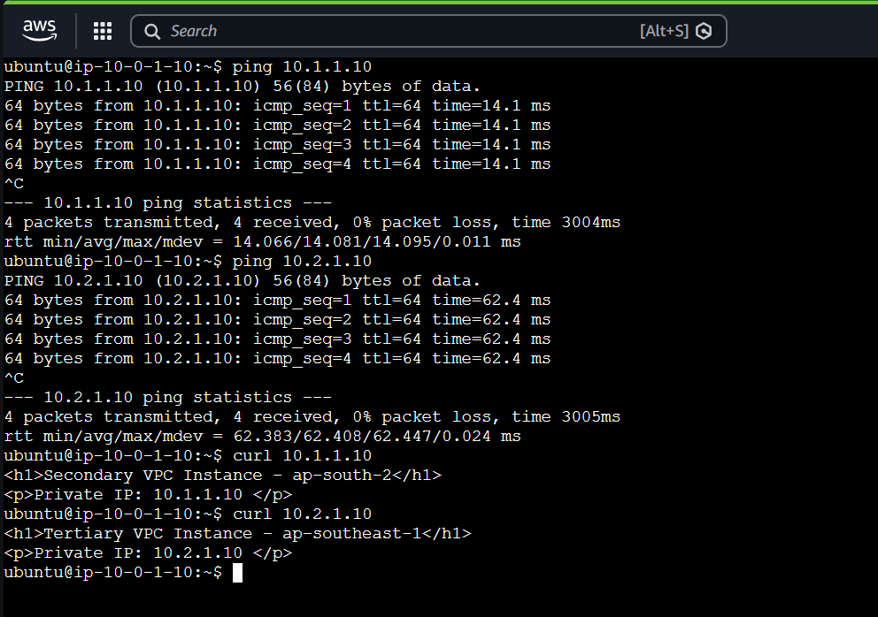
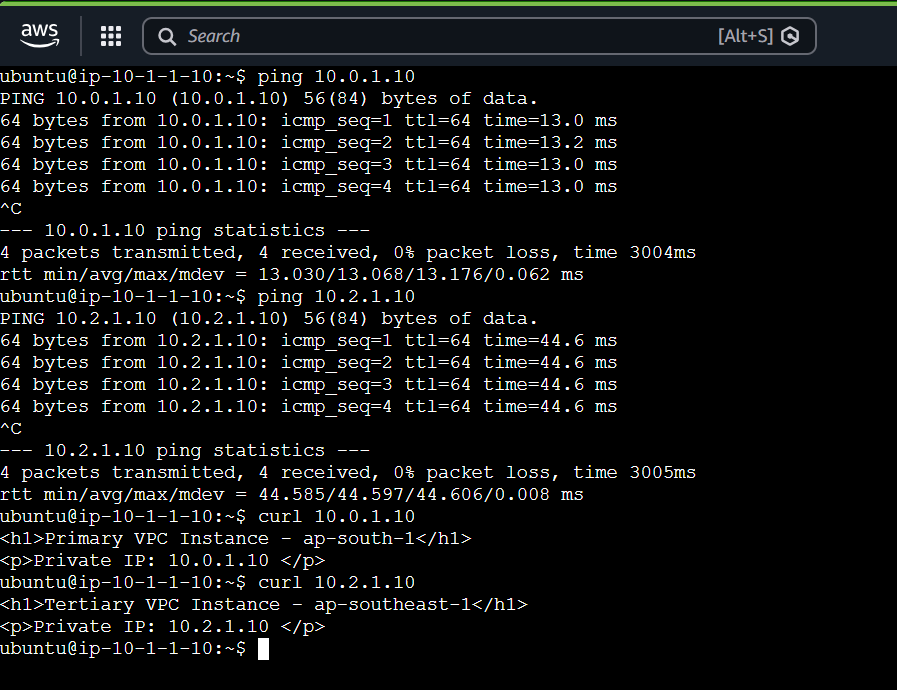
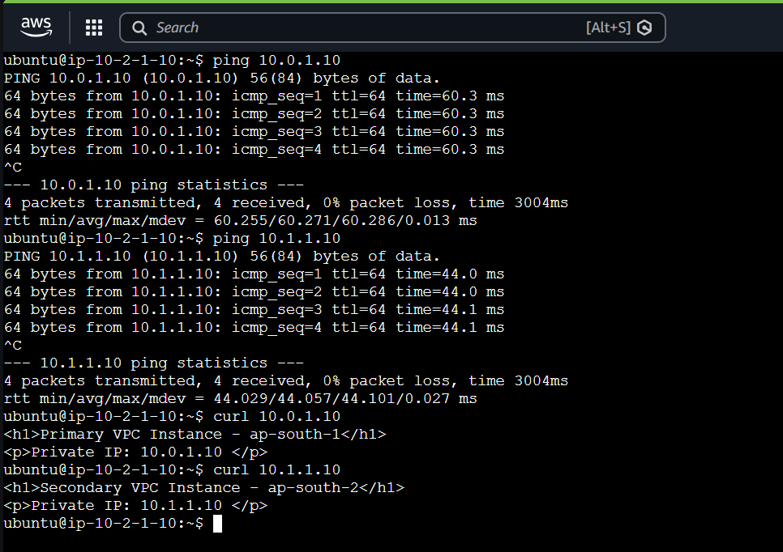
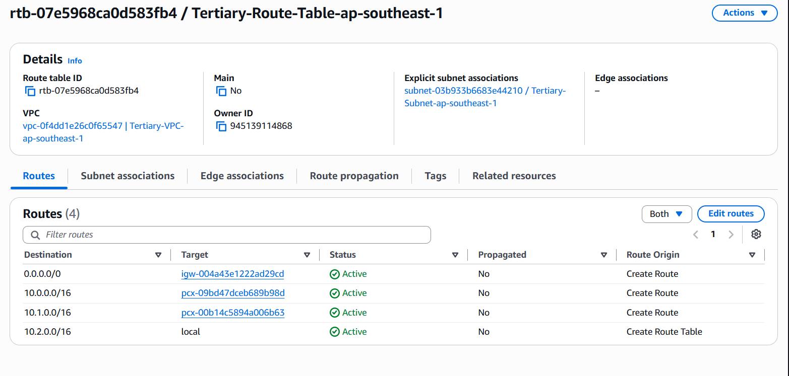
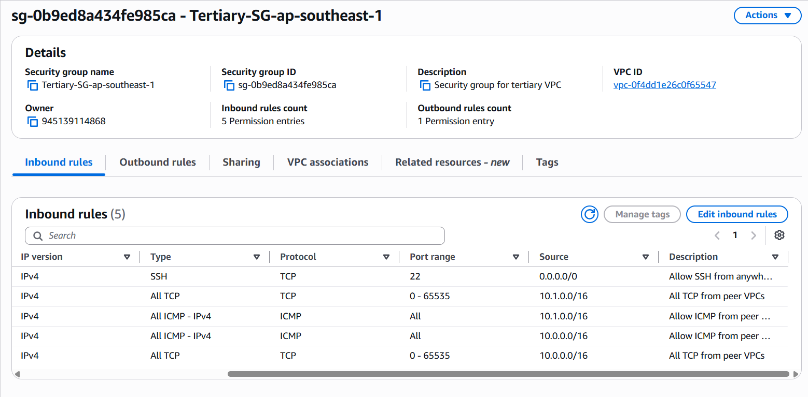

# Full-Mesh VPC Peering (3 VPCs, no Transit Gateway)

Transitive-style reachability across three VPCs in three regions
(`ap-south-1`, `ap-south-2`, `ap-southeast-1`) using **only VPC peering**.
Because peering is non-transitive, every pair is peered directly — a full mesh
of three connections. Validated with all-to-all private connectivity between
instances in every region.

> Part of the [VPC Peering series](../README.md):
> [2-VPC](../2-vpc-peering/) · **3-VPC full mesh (this)** ·
> [3-VPC transit gateway](../3-vpc-transit-gateway/)
>
> Peering, route-table and security-group **fundamentals** are covered in the
> [2-VPC project](../2-vpc-peering/). This README covers only what is **specific
> to a 3-VPC mesh**.

## Architecture

## AWS Services Used

| Service | Purpose |
|---|---|
| **VPC Peering** | Three connections (A↔B, A↔C, B↔C) forming a full mesh |
| **Route Tables** | Route each peer CIDR through the correct peering connection |
| **Security Groups** | Allow ICMP/TCP from **all** peer VPC CIDRs |
| VPC | Three isolated networks — `10.0.0.0/16`, `10.1.0.0/16`, `10.2.0.0/16` |
| Subnets | One public `/24` per VPC |
| Internet Gateway | Outbound access for instance bootstrap and SSH |
| EC2 | Endpoints used only to validate connectivity |
| Key Pairs | Per-region key pair for least-privilege SSH |
| S3 | Remote, encrypted Terraform state backend |

## Core Concepts

### Full-Mesh Peering

- Peering is non-transitive, so three VPCs cannot chain through one another — every pair must be peered directly.
- Three VPCs → three connections (A↔B, A↔C, B↔C); in general N VPCs need **N(N−1)/2**.
- Connection count grows quadratically, so a mesh only suits a handful of VPCs.
- A Transit Gateway hub is the alternative — one attachment per VPC (linear) with transitive routing built in.

<table><tr>
<td></td>
<td></td>
</tr></table>

*The two tertiary edges — Mumbai↔Singapore and Hyderabad↔Singapore — status **Active**, completing the mesh alongside Mumbai↔Hyderabad.*

<table><tr>
<td></td>
<td></td>
<td></td>
</tr></table>

*Each instance reaches **both** other regions by private IP (0% loss) — every VPC reaches every other across the mesh.*

### Route Tables in a Mesh

- Each VPC must route to **every** other VPC's CIDR, so each route table holds multiple peer routes — one per peer.
- A single missing peer route silently breaks that direction while the rest keeps working.

*The tertiary route table forwards **both** peer CIDRs (`10.0.0.0/16`, `10.1.0.0/16`) to their peering connections.*

### Security Groups in a Mesh

- Each instance must accept traffic from **all** other VPCs, so every SG lists all peer CIDRs — not just one.
- Copying a two-VPC rule that names a single peer is a common mesh mistake that drops one peer's traffic.

*Inbound ICMP + all-TCP from **both** peer CIDRs — required so the instance accepts traffic from every other VPC.*

## Project Implementation

- Three VPCs across `ap-south-1`, `ap-south-2`, `ap-southeast-1` with non-overlapping CIDRs.
- Full mesh of three cross-region peering connections.
- Each route table routes to both peer CIDRs.
- Each security group admits ICMP + TCP from both peer VPC CIDRs.
- Per-region key pairs for least-privilege SSH isolation.
- Three regions managed from one Terraform configuration; remote encrypted state.

## Key Learnings

- Non-transitivity forces a full mesh — **N(N−1)/2** connections.
- Every route table needs a route to **every** peer CIDR.
- Every security group must list **all** peer CIDRs — one omission silently breaks a path.
- A mesh doesn't scale; a **Transit Gateway** provides transitive routing at linear cost.
