# Multi-Region Connectivity with AWS Transit Gateway

Private connectivity between two VPCs in two regions (`ap-south-1` and
`ap-south-2`) using **AWS Transit Gateway**. Each VPC attaches to its own
regional Transit Gateway, and the two gateways are joined by a **cross-region
Transit Gateway peering** — traffic flows VPC → local TGW → peer TGW → peer VPC,
entirely over private IPs. Validated with live ICMP and HTTP across regions.

> Part of the [VPC Peering series](../README.md):
> [2-VPC](../2-vpc-peering/) · [3-VPC full mesh](../3-vpc-full-mesh/) ·
> **Transit gateway (this)**
>
> VPC, subnet, route-table and security-group **fundamentals** are covered in
> the [2-VPC project](../2-vpc-peering/). This README covers only what is
> **specific to Transit Gateway**.

## Architecture

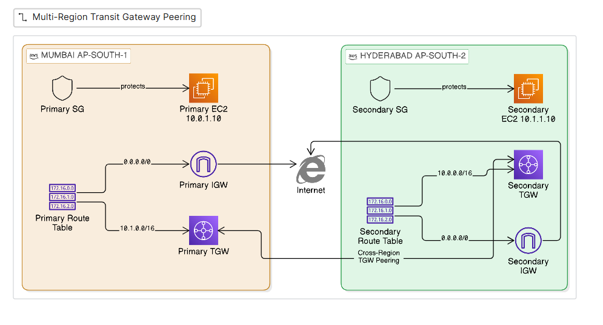

## AWS Services Used

| Service | Purpose |
|---|---|
| **Transit Gateway** | Regional hub that routes between attached networks (one per region) |
| **TGW VPC Attachment** | Connects each VPC to its local Transit Gateway |
| **TGW Peering Attachment** | Joins the two regional gateways across regions |
| **TGW Route Table** | Controls routing between attachments (associations, propagations, static routes) |
| VPC · Subnet · IGW · Route Table | Standard networking base (one per region) |
| Security Groups | Allow ICMP/TCP from the peer VPC CIDR |
| EC2 | Endpoints used only to validate connectivity |
| S3 | Remote, encrypted Terraform state backend |

## Core Concepts

### AWS Transit Gateway

- A **regional hub** that connects VPCs (and VPN / Direct Connect) through a single attachment each.
- Routing is **transitive** — attachments reach each other through the gateway, with no per-pair connections.
- Scales **linearly**: N VPCs = N attachments, versus a peering mesh's N(N−1)/2.
- A Transit Gateway is **regional**, so this project uses **one per region** (Mumbai and Hyderabad), each with the default route table disabled so routing is managed explicitly.

<table><tr>
<td>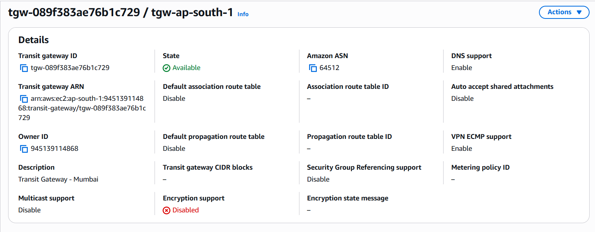</td>
<td>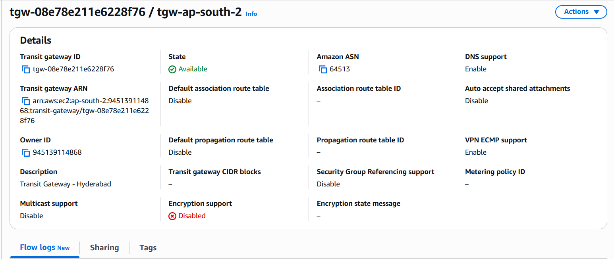</td>
</tr></table>

*Both gateways **Available**, distinct ASNs (64512 / 64513), default route-table association and propagation **disabled**.*

### VPC Attachments

- Each VPC connects to its **local** Transit Gateway with one attachment.
- The VPC's own route table then sends the peer CIDR to the gateway, handing inter-VPC traffic to the hub.

<table><tr>
<td>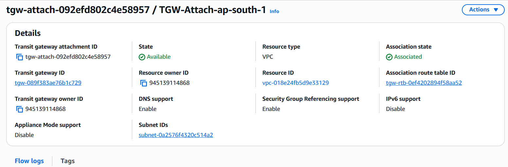</td>
<td>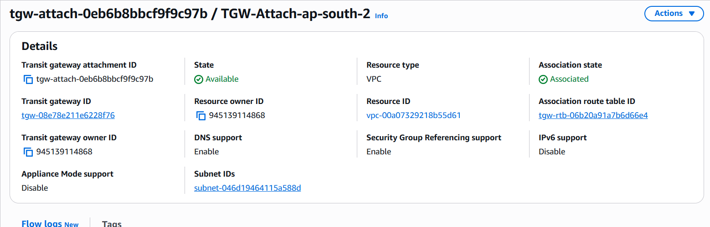</td>
</tr></table>

*Each VPC attachment **Available** and **Associated** with its region's TGW route table.*

### Cross-Region TGW Peering

- A Transit Gateway is regional, so spanning regions requires **peering the gateways** — a requester creates the peering and the peer region **accepts** it (cross-region is never auto-accepted).
- Once active, the peering attachment carries traffic between the two gateways.

<table><tr>
<td>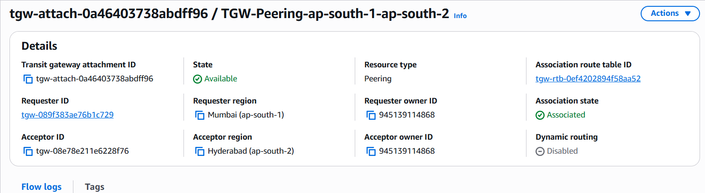</td>
<td>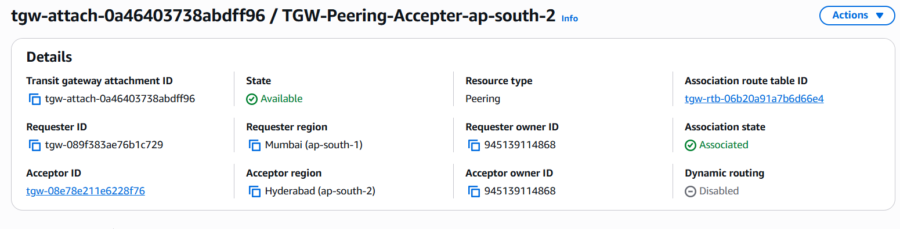</td>
</tr></table>

*Requester (Mumbai) and accepter (Hyderabad) views of the same peering attachment — **Available** and **Associated**.*

The end-to-end result — each instance reaches the other region by private IP:

<table><tr>
<td>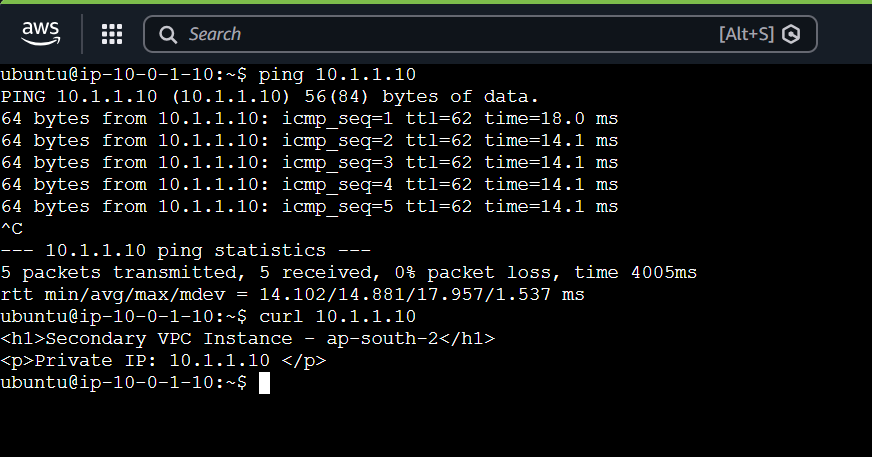</td>
<td>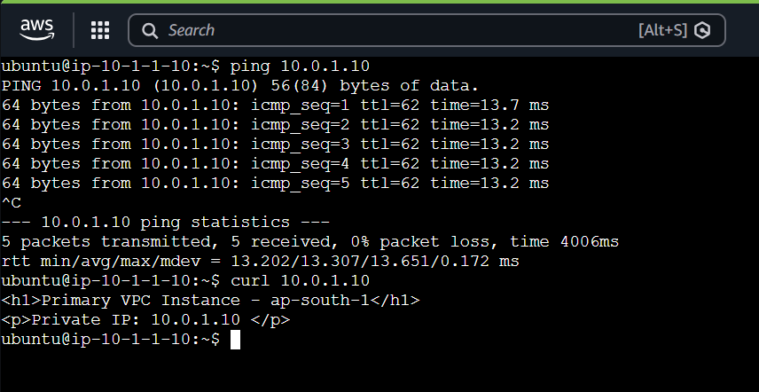</td>
</tr></table>

*Ping (0% loss) and curl succeed both directions between `10.0.1.10` and `10.1.1.10` — traffic crosses regions over the TGW peering.*

### TGW Route Tables

- Each gateway uses a **custom route table**; **associations** decide which route table an attachment uses, **propagations** inject the attachment's routes.
- Propagation only learns the **local** VPC CIDR — the **remote** CIDR is added as a **static route** pointing at the peering attachment (propagation doesn't cross a peering).
- The **peering attachment is also associated** with the route table, so traffic arriving from the peer region is routed onward to the local VPC.

<table><tr>
<td>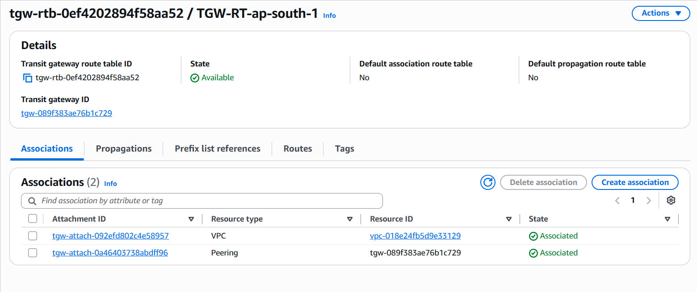</td>
<td>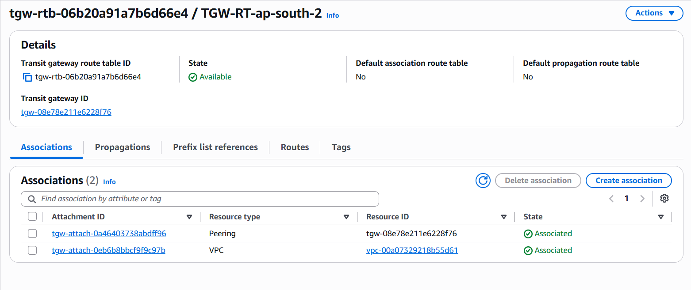</td>
</tr></table>

*Each TGW route table associates **both** the local VPC attachment and the peering attachment.*

## Project Implementation

- Two VPCs in `ap-south-1` and `ap-south-2`, each attached to its own regional Transit Gateway.
- The two gateways joined by a cross-region Transit Gateway peering (requester / accepter).
- Custom TGW route tables — local VPC CIDR via propagation, remote CIDR via a static route over the peering.
- Each VPC route table sends the peer CIDR to its local gateway.
- Security groups admit ICMP + TCP from the peer VPC CIDR; per-region key pairs for SSH.

## Key Learnings

- A Transit Gateway gives **transitive** routing with **one attachment per VPC** — linear, not the mesh's N(N−1)/2.
- A Transit Gateway is **regional**; spanning regions requires **cross-region TGW peering** (with an accepter).
- Custom route tables need explicit **associations and propagations**, and the **peering attachment must be associated** or return traffic is dropped.
- Propagation learns only **local** CIDRs — remote CIDRs across a peering require **static routes**.
