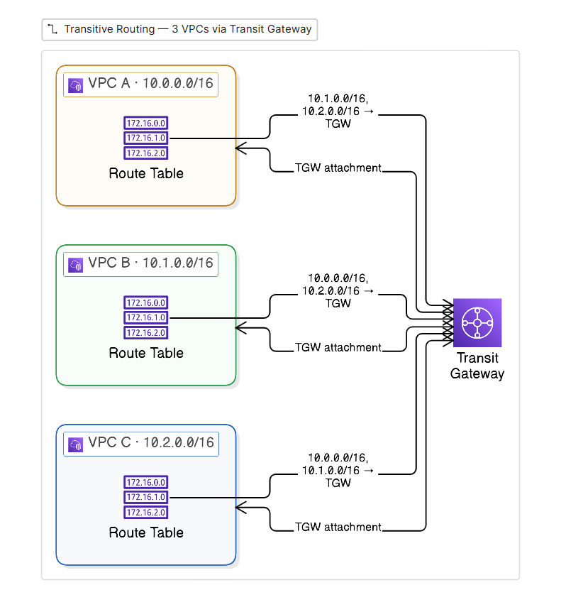

# 3-VPC Connectivity with AWS Transit Gateway

Transitive connectivity across three VPCs using an **AWS Transit Gateway** as a
central hub. Each VPC attaches once to the gateway, which routes between all
attachments — giving all-to-all reachability without peering every pair.

> Part of the [VPC Peering series](../README.md):
> [2-VPC](../2-vpc-peering/) · [3-VPC full mesh](../3-vpc-full-mesh/) ·
> **3-VPC transit gateway (this)**
>
> Peering, route-table and security-group **fundamentals** are covered in the
> [2-VPC project](../2-vpc-peering/). This README covers only what is **specific
> to a Transit Gateway**.
>
> **Status:** 📐 Design / planned — theory below; screenshots added after deployment.

## Architecture

## AWS Services Used

| Service | Purpose |
|---|---|
| **Transit Gateway** | Central hub that routes transitively between all attached VPCs |
| **Transit Gateway Attachments** | One attachment per VPC into the hub |
| **Route Tables** | Send peer CIDRs to the gateway instead of to a peering connection |
| VPC | Three isolated networks — `10.0.0.0/16`, `10.1.0.0/16`, `10.2.0.0/16` |
| Subnets | One subnet per VPC for the attachment and instance |
| EC2 | Endpoints used only to validate connectivity |
| S3 | Remote, encrypted Terraform state backend |

## Core Concepts

### AWS Transit Gateway

- A regional hub that connects many VPCs (and VPN / Direct Connect) through a single attachment each.
- Routing is **transitive** — any attached network can reach any other through the gateway.
- Scales **linearly**: N VPCs = N attachments, versus a peering mesh's N(N−1)/2 connections.
- Each VPC route table points peer CIDRs at the gateway instead of at individual peering connections.
- Regional service — multi-region topologies use one gateway per region joined by inter-region gateway peering.

_Screenshot slot: Transit Gateway with three attachments in "available" state._

### Transit Gateway Route Table

- The gateway has its own route table; **associations** decide which attachment uses it and **propagations** decide which routes it learns.
- This enables **segmentation** — e.g. isolating environments — which a flat peering mesh cannot express.
- Full reachability is the default; segmentation is opt-in via separate gateway route tables.

_Screenshot slot: gateway route table showing the three VPC CIDRs as active routes._

_Screenshot slot: all-to-all ping/curl between the three instances over private IPs._

## Project Implementation

- Three VPCs with non-overlapping CIDRs attached to a single Transit Gateway.
- Each VPC route table directs the other VPCs' CIDRs to the gateway.
- The gateway route table associates and propagates all three attachments for full reachability.
- EC2 endpoints used to validate transitive connectivity across the hub.

## Key Learnings

- A Transit Gateway provides **transitive** routing — no need to peer every pair.
- Attachments scale **linearly** (N), unlike a peering mesh (N(N−1)/2).
- Gateway route-table associations vs propagations control reachability and enable segmentation.
- A Transit Gateway is **regional**; spanning regions requires inter-region gateway peering.
